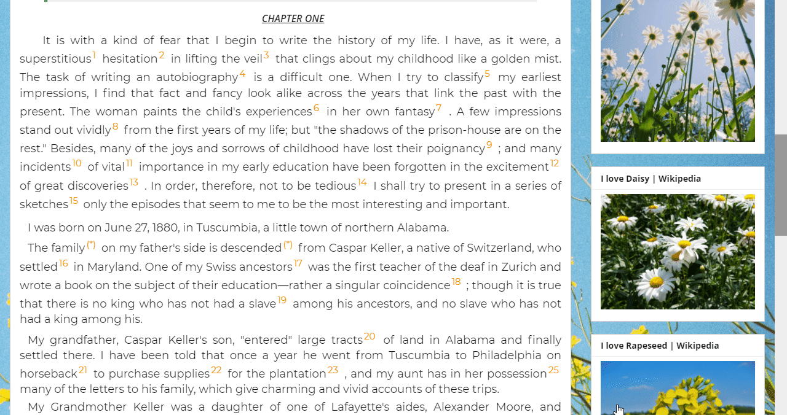
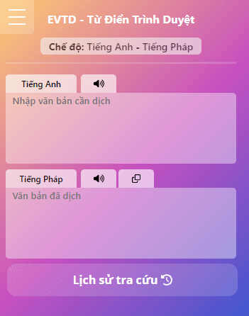
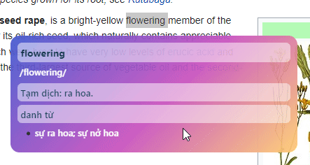
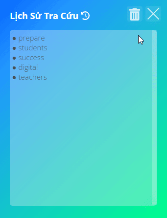
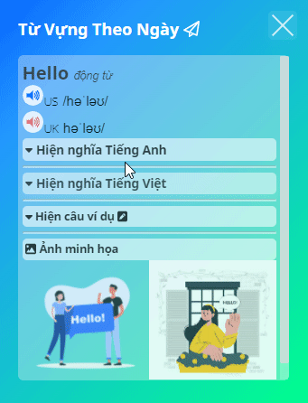

# [Hướng dẫn sử dụng Tiếng Việt](./Help.md)
# 👋 Welcome to EVTD - LoveGuide
# 🚀 Demo


# Tutorials
* Configure dictionary mode before use
<p align="center">
  
</p>

---
* Double-click the word you want to look up.
* Press the ```Shift``` & ```click``` buttons on the first and last characters to translate.

<p align="center">
  
</p>

---
* Change the background color as your style
<p align="center">
  
</p>

---
* Easily lookup history
<p align="center">
  
</p>

---
* Discover new words every day
<p align="center">
  
</p>

---
 
## Make with ❤ by
* Toan Tran Cong
* Van Anh Dao Thi 
* Hieu Nguyen Minh
